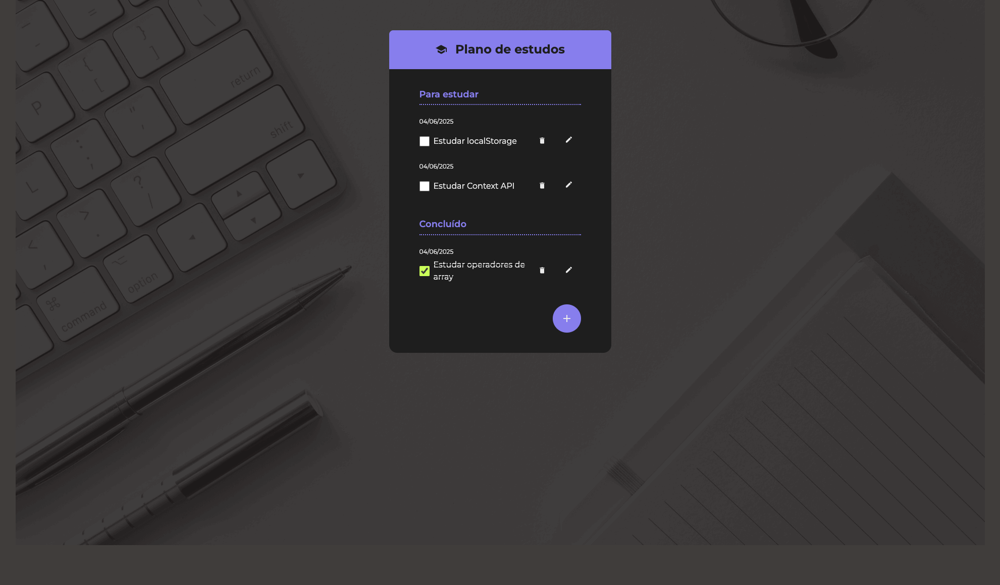

# Study Checklist App
Project developed as part of a React course on Alura, focused on building a study checklist application.

## 🔨 Project Features

* Add, edit, and delete tasks
* Organize tasks into “To Study” and “Completed”
* Mark tasks as completed
* Visual feedback for empty lists (empty state)
* Modal for adding and editing tasks
* Animated task list



## ✔️ Techniques and Technologies Used

The development of this project includes the following techniques and technologies:

* **useState e useEffect**: State management and persistence using localStorage
* **useContext**: Global context to share task state
* **Componentization**: Reusable components such as Button, FabButton, Dialog, TodoForm, TodoItem, and TodoGroup
* **Styling with CSS Modules**: Organized styles by component
* **Controlled form handling**
* **Local persistence with localStorage**: Keeps tasks saved even after closing the app
* **Custom SVG icons**
* **Code organization best practices**

## 🛠️How to Run the Project

After downloading the project, follow the steps below to run it locally:

1. Make sure you have Node.js installed ([official guide](https://nodejs.org/en/download/)).
2. In the terminal, navigate to the project folder and install the dependencies:

```bash
npm install
```

3. Run the project:

```bash
npm run dev
```

4. Open your browser and access: [http://localhost:5173](http://localhost:5173) (Vite).
